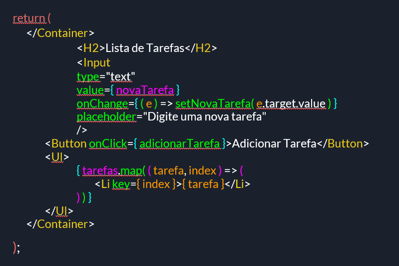

## Lista de tarefas usando hook useCallback

### O que é e para que serve o useCallback
O useCallback é um react rook que serve para armazenar funções em cache, otimizando o desempenho de componentes e evitando que esse seja reenderizado desnecessariamente em uma aplicação.

### Passo a passo construção do código 
### 1. Importação de Dependências

import React, { useState, useCallback } from 'react';

- Importando React, o hook useState para gerenciar o estado do componente e o useCallback para memorizar funções.

### 2. Definição do Componente ListaDeTarefas

function ListaDeTarefas() {}

- Criamos o componente funcional ListaDeTarefas, que será responsável por exibir a lista de tarefas e permitir a adição de novas.

### 3. Declaração dos Estados

const [ tarefas, setTarefas ] = useState([]) 
const [ novaTarefa, setNovaTarefa ] = useState('')

- tarefas : é um estado que armazena uma lista de tarefas, inicialmente definida como um array vazio.
- novaTarefa : é um estado que armazena o valor atual do input, onde o usuário digita a nova tarefa. Começa como uma string vazia.

### 4. Função adicionarTarefa com useCallback

- useCallback memoriza a função adicionarTarefa para que ela só seja recriada quando a variável novaTarefa mudar.
- A função adicionarTarefa faz o seguinte:  Verifica se novaTarefa não é uma string vazia após remover espaços extras com 'trim()'.
- Usa setTarefas para atualizar a lista de tarefas, adicionando a nova tarefa ao array existente. O uso de (prevState) => [...prevState, novaTarefa] garante que o estado seja atualizado de forma segura com base no valor anterior.
- setNovaTarefa("") -> limpa o campo novaTarefa,  definindo-o como uma string vazia para que o input seja resetado.

### 5. Renderização do JSX 

